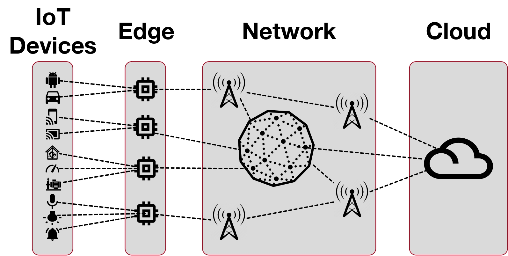

# A Domain-Specific Language for Simulation-Based Testing of IoT Edge-to-Cloud Solutions

This repository contains the code and results used in the paper "A Domain-Specific Language for Simulation-Based Testing of IoT Edge-to-Cloud Solutions". This paper introduces a domain-specific language (DSL), IoTECS, designed for creating edge-to-cloud simulators, imperative in testing IoT systems for applications like smart cities or autonomous vehicles. Developed in conjunction with IoT analytics firm Cheetah Networks, the language aims to validate the scalability of cloud applications under heavy IoT device loads. Implemented using Xtext, IoTECS`s utility is empirically evaluated, and the paper also presents reflections on the findings.



## Abstract

The Internet of things (IoT) is increasingly prevalent in domains such as emergency response, smart cities and autonomous vehicles. Simulation plays a key role in the testing of IoT systems, noting that field testing of a complete IoT product may be infeasible or prohibitively expensive. In this paper, we propose a \emph{domain-specific language (DSL)} for generating edge-to-cloud simulators. An edge-to-cloud simulator executes the functionality of a large array of edge devices that communicate with cloud applications. Our DSL, named IoTECS, is the result of a collaborative project with an IoT analytics company, Cheetah Networks. 
The industrial use case that motivates IoTECS is ensuring the scalability of cloud applications by putting them under extreme loads from IoT devices connected to the edge. We implement IoTECS using Xtext and empirically evaluate its usefulness. We further reflect on the lessons learned.

## Directory Structure

```bash
.
├── baselines
│   ├── JMeter
│       ├── JMeter files
│   ├── Locust
│       ├── Locust files
├── scripts
│       ├── scripts
├── IoTECS
│   ├── IoTECS directories

```

The directories serve the following purposes:

- `baselines`: Hosts benchmark load testing simulators employed in the comparative analysis of this study.
- `JMeter`: Contains files pertaining to JMeter, an established load testing tool used as a reference point in this research.
- `Locust`: Holds files related to Locust, another well-recognized load testing tool included for comparative evaluation.
- `scripts`: Contains the executable scripts designed to generate the empirical results presented in the study.
- `IoTECS`: Encompasses the directories and files that constitute IoTECS, the simulator proposed and evaluated in this research paper.

## Prerequisites

Before starting, ensure your system has these tools installed:

- Eclipse 2021-12
- JDK 11
- Virtual Box 6.1
- Docker 20.10.11
- Xtext 2.25.0 ([Download](https://www.eclipse.org/Xtext/))
- Xtend 2.25.0 ([Download](https://www.eclipse.org/Xtend/))
- Ubuntu 20.04 disc image ([Download](https://ubuntu.com/download/desktop))
- TShark (Wireshark) 3.4.9
- Python 3.8.8
- SSH

## Installation and Running Steps

Follow these steps to perform simulation-based testing for IoT Cloud applications using IoTECS:

1. Extract the contents of `IoTECS.zip` and open all the projects in Eclipse.
2. Navigate to `iotecs->src->iotecs->IoTECS.xtext`, then run as "Generate Xtext Artifacts".
3. Go to `iotecs->src->iotecs->GenerateIoTECS.mwe2`, and run as "MWE2 Workflow".
4. Launch the DSL project (`iotecs`) as "Eclipse Applications", choosing to launch "Runtime Eclipse".
5. Create Ubuntu 20.04 virtual machines (via Virtual Box) for each platform of type "VM".
6. Install Python, JDK, and TShark on both the local machine and all remote platforms.
7. In the runtime Eclipse Platform, create a new Java project and a new file with an "iot" extension (e.g., `test.iot`). If asked to convert 'test' to an Xtext project, select "yes". Input the specific instance of the conceptual model for IoTECS according to the grammar or use the provided demonstration IoTECS project and modify it as necessary.
8. Save the file created in step 7. This will generate code and scripts in the "src-gen" directory of the project (e.g., `test->src-gen`).
9. Install OpenSSH and ensure that localhost, Platforms, and SimulationNodes can communicate using ssh and scp.
10. Navigate to the generated directory of the IoTECS project (`src-gen/`) and run `main.sh`.

Ensure you follow the steps in the provided order for successful setup and execution of your IoT Cloud applications with IoTECS.
